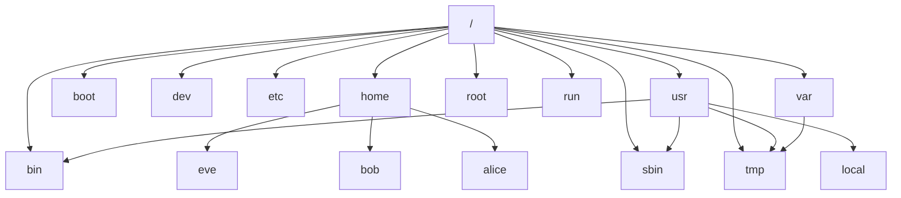

# File System



```
project
│   README.md
│   file001.txt    
│
└───folder1
│   │   file011.txt
│   │   file012.txt
│   │
│   └───subfolder1
│       │   file111.txt
│       │   file112.txt
│       │   ...
│   
└───folder2
    │   file021.txt
    │   file022.txt
```

# Important Linux Directories

| Syntax | Description |
|--------| ------------|
|<a href="#bin">/bin</a>| contains the system binary|
|<a href="#boot">/boot</a> | <p>Contains the initramfs and kernel image</p><p>Files needed in order to start the boot process</p>|
|<a href="#dev">/dev</a>|<p><li>Contains special <b>device files</b> that are used by the system to access hardware</p><p><li>Device files like block and character devices</p>|
|<a href="#etc">/etc</a> | Configuration files specific to this system|
|<a href="#home">/home</a>|<p><b><li>Home directories</b> are where regular users store their personal data and configuration files</p><p><li>Contains user's Home Directory</p>|
|<a href="#root">/root</a> |Home directory for the adminstrative super-user,root|
|<a href="#run">/run</a>| Runtime data for processes started since the last boot.This includes process ID files and lock files,among other things.The contents of this directory are recreated on reboot.This directry consolidates <b>/var/run</b> and<b>/var/lock </b> from earlier versions of RHEL|
|<a href="#sbin">sbin</a> | Binary utilities for which only root or system adminstrator has access|
|<a href="#tmp">/tmp</a>| <p><li>A world-writable space for temporary files.Files which have not been accessed,changed or modifiled for 10 days are deleted form this directory automatically.Another tempoary directory exists<b>/var/tmp</b> in which files that have not been accessed,changed or modified in more than 30 days are deleted automatically</p><p><li>Used for storing tempoary data and files</p>|
|<a href="#usr">/usr</a> | <p>Installed software,shared libraries,include files and files and read-only program data.</p>Important subdirectories include: <li><b>/usr/bin:</b>User commands</li> <li><b>/usr/sbin:</b>System administration commands</li><li><b>/usr/local:</b>Locally cutomized software</li>|
|<a href="#var">/var</a>| <p><li>Variable data specific to this system that should persist between boot.Files that dynamically change such as databases,cache directories,log files,printer-spooled documents,and website content may be found under <b>/var</b></li></p><p><li>Data which varies over time</p>|
|<a href="#lib">/lib</a> |Shared library and kernel modules|
|<a href="#lib64">/lib64</a>| Contains 64-bit version shred library|
|<a href="#mnt">/mnt</a> | mount point of file system|
|<a href="#proc">/proc</a>| Kernel data structure mounted ad filesystem.only applicable to linux based os|
|<a href="#sys">/sys</a> | Kernel data structure for different hardware and device Block Device,Firmware,ACPI etc.Applicable for linux base os only|

# /boot
# /dev
# /etc
# /home
# /root
# /run
# /tmp
# /usr
# /var
<div class="container">
In Red Hat Enterprise Linux 7 and later, four older directories in <b>/</b> have identical
contents to their counterparts located in /usr:

* * /bin and /usr/bin
* * /sbin and /usr/sbin
* * /lib and /usr/lib
* * /lib64 and /usr/lib64

In earlier versions of Red Hat Enterprise Linux, these were distinct directories
containing different sets of files.
In Red Hat Enterprise Linux 7 and later, the directories in / are symbolic links to the
matching directories in /usr
</div>