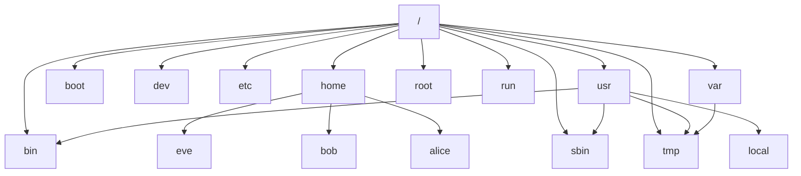

# File System



```
project
│   README.md
│   file001.txt    
│
└───folder1
│   │   file011.txt
│   │   file012.txt
│   │
│   └───subfolder1
│       │   file111.txt
│       │   file112.txt
│       │   ...
│   
└───folder2
    │   file021.txt
    │   file022.txt
```