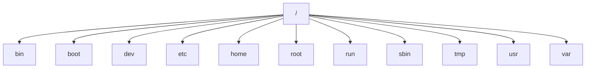

# File System

```mermaid
    graph TD;
    / -->bin;
    / --> boot;
    / -->dev;
    / -->etc;
    / -->home;
    / -->root;
    / -->run;
    / -->sbin;
    / -->tmp;
    / -->usr;
    / -->var;
```

